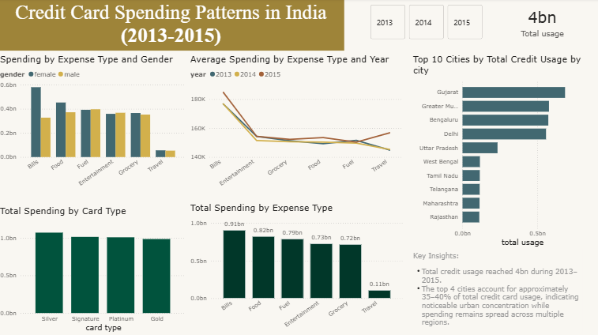

# Credit Card Spending Patterns in India (2013–2015)

## Project Overview
This project analyzes credit card spending patterns in India from 2013 to 2015 to understand consumer behavior across expense categories, card types, gender, and major cities. The objective is to identify key usage trends and spending concentration that can support data-driven business and strategic decisions.

## Tools
- SQL (data cleaning and aggregation)
- Power BI (data modeling and visualization)
- Descriptive Data Analysis

## Key Questions
- Which expense categories contribute the most to total credit card spending?
- How does spending behavior differ across major cities?
- Are there observable differences in spending patterns between male and female users?
- How is total spending distributed across card types?

## Dashboard Preview

## Key Insights
- Total credit card usage reached approximately **4bn** during the 2013–2015 period.
- Credit card spending is highly concentrated in urban areas, with the **top 4 cities contributing over half of total usage**.
- Overall spending patterns between male and female users are broadly similar, **with moderate differences observed in certain expense categories**.
- Travel-related expenses show the most noticeable growth trend over time compared to other categories.
- Total spending is relatively evenly distributed across card types, with **no single card type clearly dominating overall usage**.

## Conclusion
The analysis indicates that credit card usage in India is primarily driven by urban centers rather than demographic factors such as gender. While minor variations exist across expense categories, location and spending category play a more significant role in influencing overall credit card usage. These insights can help inform regional targeting strategies and spending-focused product offerings.
